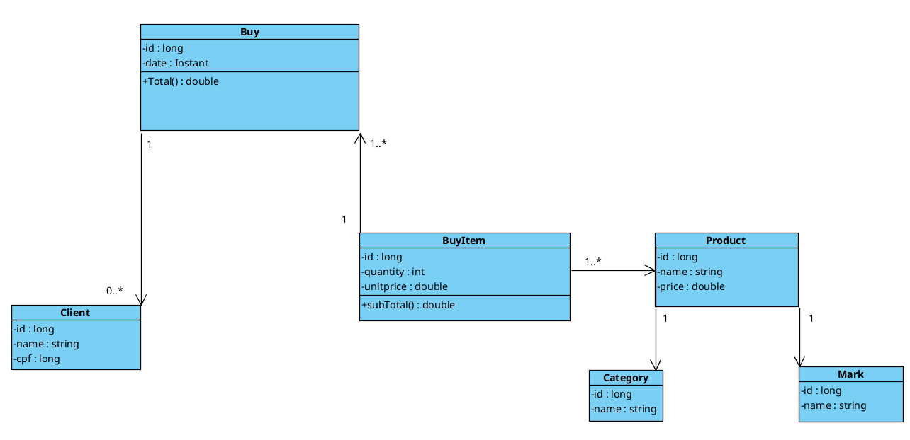

# Projeto Supermarket-system


---

## Diagrama de Classes


---

## Sobre o projeto

Projeto de API REST desenvolvido em Java com Spring Boot, inspirado em um sistema de supermercado real, com foco em regras de negócio e integridade de dados.
O objetivo é aplicar na prática conceitos de arquitetura em camadas, regras de negócio, DTOs,
tratamento de exceções e boas práticas no desenvolvimento back-end.

Este projeto foi criado com foco em aprendizado prático e evolução técnica.

---

## Tecnologias utilizadas

- Java 21
- Spring Boot
- Spring Data JPA
- Hibernate
- MySQL
- Maven

---

## Estrutura de pastas

```text
src/
├── main
│   ├── java
│   │   └── com
│   │       └── alexdev
│   │           ├── config
│   │           │   └── TestConfig.java
│   │           ├── controllers
│   │           │   ├── BuyController.java
│   │           │   ├── BuyItemController.java
│   │           │   ├── CategoryController.java
│   │           │   ├── ClientController.java
│   │           │   ├── MarkController.java
│   │           │   └── ProductController.java
│   │           ├── dto
│   │           │   ├── request
│   │           │   │   ├── BuyCreateDTO.java
│   │           │   │   ├── BuyItemCreateDTO.java
│   │           │   │   ├── CategoryCreateDTO.java
│   │           │   │   ├── ClientCreateDTO.java
│   │           │   │   ├── MarkCreateDTO.java
│   │           │   │   └── ProductCreateDTO.java
│   │           │   └── response
│   │           │       ├── BuyDTO.java
│   │           │       ├── BuyItemDTO.java
│   │           │       ├── CategoryDTO.java
│   │           │       ├── ClientDTO.java
│   │           │       ├── MarkDTO.java
│   │           │       └── ProductDTO.java
│   │           ├── entities
│   │           │   ├── BuyItem.java
│   │           │   ├── Buy.java
│   │           │   ├── Category.java
│   │           │   ├── Client.java
│   │           │   ├── Mark.java
│   │           │   └── Product.java
│   │           ├── exceptions
│   │           │   ├── BusinessException.java
│   │           │   ├── handler
│   │           │   │   ├── GlobalExceptionHandler.java
│   │           │   │   └── StandardError.java
│   │           │   └── ResourceNotFoundException.java
│   │           ├── mappers
│   │           │   ├── BuyItemMapper.java
│   │           │   ├── BuyMapper.java
│   │           │   ├── CategoryMapper.java
│   │           │   ├── ClientMapper.java
│   │           │   ├── MarkMapper.java
│   │           │   └── ProductMapper.java
│   │           ├── repositories
│   │           │   ├── BuyItemRepository.java
│   │           │   ├── BuyRepository.java
│   │           │   ├── CategoryRepository.java
│   │           │   ├── ClientRepository.java
│   │           │   ├── MarkRepository.java
│   │           │   └── ProductRepository.java
│   │           ├── services
│   │           │   ├── BuyItemService.java
│   │           │   ├── BuyService.java
│   │           │   ├── CategoryService.java
│   │           │   ├── ClientService.java
│   │           │   ├── MarkService.java
│   │           │   └── ProductService.java
│   │           └── SupermarketSystemApplication.java
│   └── resources
│       └── application.yaml
└── test
    └── java
        └── com
            └── alexdev
                └── SupermarketSystemApplicationTests.java
```

---

## Funcionalidades

- Cadastro e consulta de produtos
- Cadastro de categorias
- Cadastro de marcas
- Cadastro de clientes
- Registro de compras e itens da compra
- Validações de regras de negócio
- Tratamento global de exceções

---

## Regras de negócio

- Uma marca não pode ser removida se estiver associada a produtos
- Um produto não pode ser removido se estiver associado a compras
- Compras e itens de compra não podem ser alterados ou removidos após criados
- Validações de dados obrigatórios na criação de recursos

---

## Como executar o projeto

### 1. Clone o repositório

```bash
git clone https://github.com/AlexbarrosDev/supermarket-system.git
```

### 2. Configure o arquivo .yaml

- configurar suas credenciais de banco de dados
- mudar para test (profile -> active -> test), isso irá popular o banco de dados

### 3. Executar o projeto

```bash
./mvnw spring-boot:run
```

### 4. Abra o Postman

- Teste os endpoints abaixo

## Lista de Endpoints da API

### Marks

- GET    /marks
- GET    /marks/{id}
- POST   /marks
- DELETE /marks/{id}

Observação:

Não permite exclusão se a marca estiver associada a produtos.

### Categories

- GET    /categories
- GET    /categories/{id}
- POST   /categories
- DELETE /categories/{id}

Observação:

Não permite exclusão se a categoria estiver associada a produtos.

### Products

- GET    /products
- GET    /products/{id}
- POST   /products
- DELETE /products/{id}

Observação:

Não permite exclusão se o produto estiver associado a itens de compra.

### Clients

- GET    /clients
- GET    /clients/{id}
- POST   /clients

Observação:

Clientes não podem ser removidos após realizarem compras.


### Buys

- GET    /buys
- GET    /buys/{id}
- POST   /buys

Observação:

Compras não podem ser alteradas ou removidas após criadas.

## Autor

**Autor:** Alex Barros
- Itapetininga - SP
- Estudante de ADS / Desenvolvedor Back-End Java

## Contato

- LinkedIn: [Alex Barros](https://www.linkedin.com/in/alex-barros-dev)
- Email: alexbarros.dev@gmail.com


